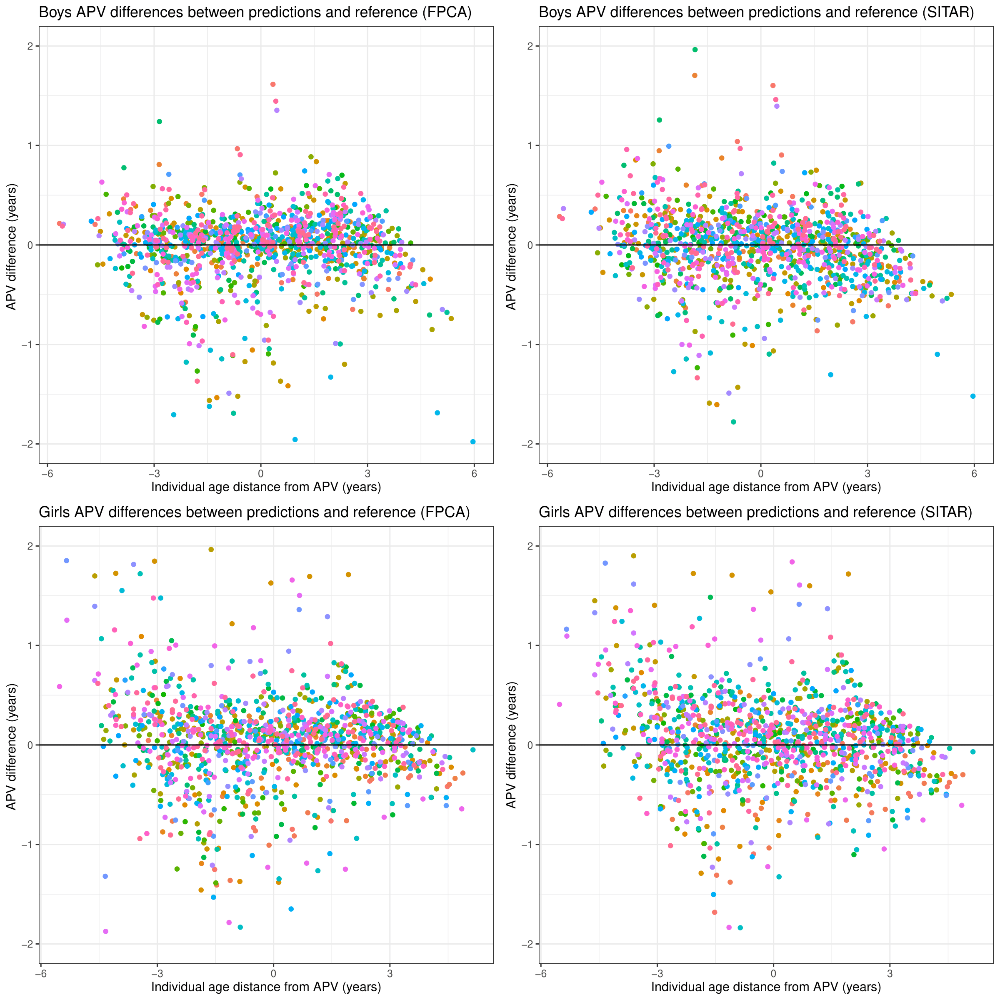

growthfd
=====
  
Fitting of FPCA-based growth curve model using Levenberg-Marquardt optimization.

## Installation

```r
install.packages("BiocManager")
BiocManager::install("pcaMethods", ask=FALSE)
install.packages("remotes")
remotes::install_version("fda", version="2.4.8.1")
remotes::install_github("ondrej-klima/growthfd", upgrage="never")
```

## Usage

The package is suitable for estimation of growth milestones from sparse stature
measurements.

<figure>
    
    <figcaption>Estimation of age at peak height velocity (PHV), comparison of growthfd (FPCA) vs. Sitar method.</figcaption>
</figure>


## Acknowledgements
The software growthfd was developed with state budget funding provided 
by the Technology Agency of the Czech Republic within the Eta Programme.

<a href="https://www.tacr.cz/en/"></a>
